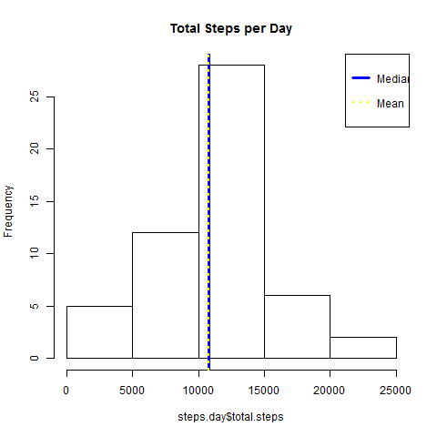
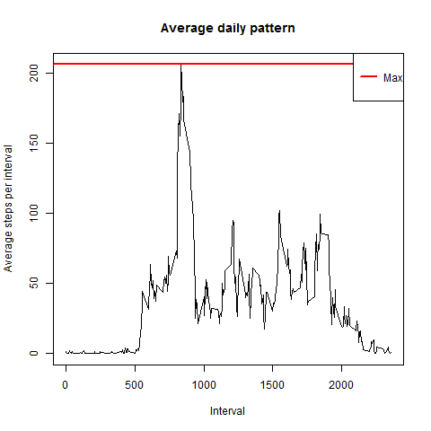
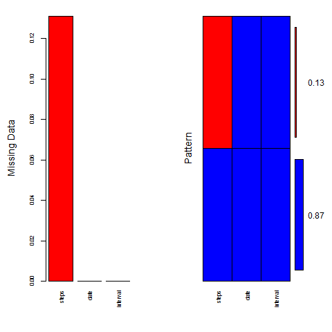
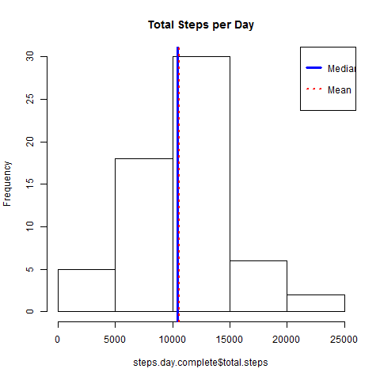
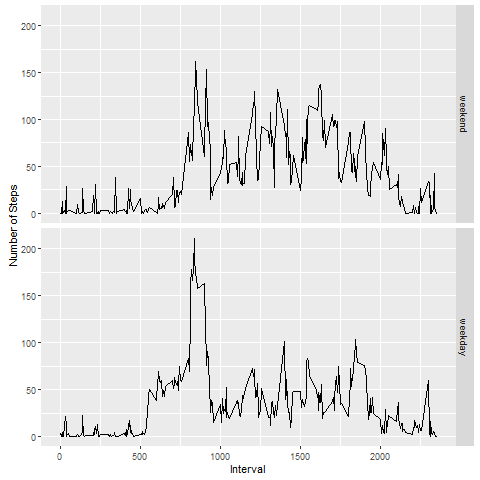

## R Markdown

This is an R Markdown document for the activity monitoring assignment. This records all steps in reproducing answers to all questions in this assignment.

We first load data of all the activities from October to November 2012. In this code chunk, NA's are also omitted from the data set:

```r
activity <- na.omit(read.table("repdata_activity/activity.csv", sep = ",", header = TRUE))
```
*Ensure that you have set the correct working directory*

Convert date format

```r
activity$date <- as.Date(activity$date, format = "%Y-%m-%d")
```

**Question 1: What is the mean total number of steps taken per day?** 

```r
steps.day <- activity %>% group_by(date) %>% summarise(total.steps = sum(steps))
hist(steps.day$total.steps, main = "Total Steps per Day")
abline(v = median(steps.day$total.steps), col = "blue", lwd = 3)
abline(v = mean(steps.day$total.steps), col = "yellow", lwd = 2, lty=3)
legend(x = "topright", c("Median", "Mean"), col = c("blue", "yellow"), lwd = c(3,2), lty = c(1,3))
```




Mean:

```
## [1] 10766.19
```
Median:

```
## [1] 10765
```

**Question 2: What is the average daily activity pattern?**

```r
avg.per.interval <- activity %>% group_by(interval) %>% summarise(mean.per.interval = mean(steps))
with(avg.per.interval, plot(interval, mean.per.interval, xlab = "Interval", ylab = "Average steps per interval", type = "l", main = "Average daily pattern"))
abline(h = max(avg.per.interval$mean.per.interval), lwd = 2, col = "red")
legend(x = "topright", c("Max"), col = c("red"), lwd = c(2))
```



Max: 

```
## [1] 206.1698
```


**Imputing missing values**

```r
activity.w.na <- read.table("repdata_activity/activity.csv", sep=",", header = TRUE)
sum(!complete.cases(activity.w.na$steps)) # Count of incomplete cases
```

```
## [1] 2304
```

```r
md.pattern(activity.w.na) #check missing data
```

```
##       date interval steps     
## 15264    1        1     1    0
##  2304    1        1     0    1
##          0        0  2304 2304
```

```r
mice.plot <- aggr(activity.w.na, col = c("blue","red"), numbers = TRUE, sortVars = TRUE, labels = names(activity.w.na), cex.axis = .7, gap = 7, ylab = c("Missing Data", "Pattern")) #visualize pct of missing data 
```



```
## 
##  Variables sorted by number of missings: 
##  Variable     Count
##     steps 0.1311475
##      date 0.0000000
##  interval 0.0000000
```

```r
activity.imputed <- mice(activity.w.na, seed = 500) #impute data, using defaults
```

```
## 
##  iter imp variable
##   1   1  steps
##   1   2  steps
##   1   3  steps
##   1   4  steps
##   1   5  steps
##   2   1  steps
##   2   2  steps
##   2   3  steps
##   2   4  steps
##   2   5  steps
##   3   1  steps
##   3   2  steps
##   3   3  steps
##   3   4  steps
##   3   5  steps
##   4   1  steps
##   4   2  steps
##   4   3  steps
##   4   4  steps
##   4   5  steps
##   5   1  steps
##   5   2  steps
##   5   3  steps
##   5   4  steps
##   5   5  steps
```

```r
activity.imputed.complete <- complete(activity.imputed, 3) #completed data, choosing 3rd data set
```

**Re-create histogram in Question 1 and display mean and median values using data set with imputed data**

```r
steps.day.complete <- activity.imputed.complete %>% group_by(date) %>% summarise(total.steps = sum(steps))
hist(steps.day.complete$total.steps, main = "Total Steps per Day")
abline(v = median(steps.day.complete$total.steps), col = "blue", lwd = 3)
abline(v = mean(steps.day.complete$total.steps), col = "red", lwd = 2, lty=3)
legend(x = "topright", c("Median", "Mean"), col = c("blue", "red"), lwd = c(3,2), lty = c(1,3))
```



Mean with imputed data:

```
## [1] 10540.95
```
Median with imputed data:

```
## [1] 10439
```

**Question 3: Are there differences in activity patterns between weekdays and weekends?**

```r
wkdays <- c("Monday","Tuesday","Wednesday","Thursday","Friday")
activity.wday <- activity.imputed.complete %>% mutate(wkday = factor((weekdays(as.Date(date)) %in% wkdays), levels = c(FALSE, TRUE), labels = c('weekend', 'weekday')))
avg.steps.wday <- activity.wday %>% group_by(wkday, interval) %>% summarise(mean.wday = mean(steps))
qplot(interval, mean.wday, data = avg.steps.wday, geom = "line", xlab = "Interval", ylab = "Number of Steps", facets = wkday ~ .)
```


